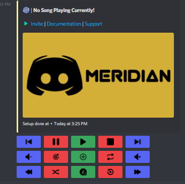

# Quick Start


**Prefix:** Meridian is a Slash-Commands-Only bot without any prefix. You need to type `/` to view the commands.


## Inviting Meridian

The first thing is to invite Meridian in your server. If you haven't already, then you can invite it by [clicking here](https://discord.com/api/oauth2/authorize?client\_id=933686221727731794\&permissions=274881342737\&scope=bot%20applications.commands). Meridian by default only asks for the permissions which it needs. Incase it is not invited with required permissions, it can malfunction and certain features may not work properly. You can read the [Permissions](faq/permissions.md) to get an overview of why we need these permissions.

## Setting up the Request Channel

The request channel can be setup using `/request-channel` command. Select the option as `Enable` and the request Channel will be created in no time!

.png>)


**Channel:** By default, Meridian creates a channel named `request-channel` while setting up the request channel. You can also supply your channel through the options if you wish to setup the request player in a desired channel.


## Streaming your First Song &#x20;

Once the Request Channel is setup, you can join a Voice Channel and send the name or URL of the song which you want to stream. You can also stream the song using `/play` command.&#x20;


**Sources:** Please check [Supported Sources](faq/music/supported-sources.md) to get an idea from where you can stream your favorite songs and playlists.


## Controlling the Player&#x20;

You can control the player using the commands which are available to use via slash commands. To check all commands, type `/help` and an embed will be created which displays every command. You can scroll through the Documentation to check usage of every command.

Additionally, you can also control the player through the buttons in the request channel. Check out the following attachment which displays the buttons.

